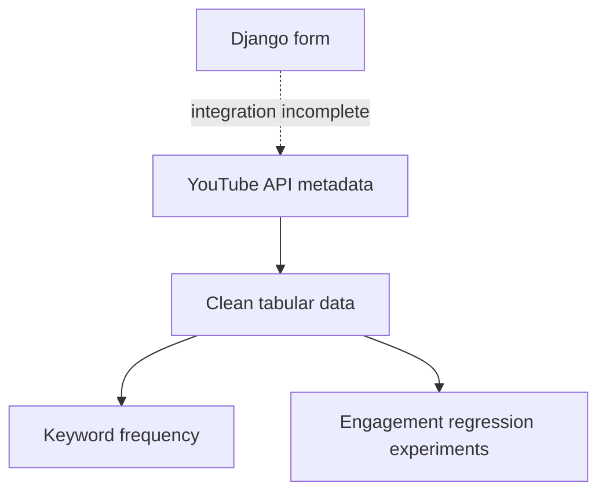

# YouTube Title & Engagement Explorer

**A Python and Django prototype for exploring YouTube metadata, keyword frequency, and engagement regression.**

This project brings together YouTube Data API collection, pandas data preparation, scikit-learn experiments, and a Django form interface. The repository name reflects its original goal; the current code explores engagement for supplied titles and does **not** generate new titles or descriptions.

> **Status: experimental, integration incomplete.** The web workflow has known blockers. No validated prediction accuracy, SEO improvement, or production deployment is claimed.

## What is here

| Component | Implementation | Current status |
| --- | --- | --- |
| Video discovery | Search queries and snippet/statistics retrieval via YouTube Data API | Requires your own API key and quota |
| Metadata preparation | CSV exports, duplicate removal, missing-value handling | Small collected snapshots; not a benchmark dataset |
| Keyword exploration | CountVectorizer over text | Frequency analysis, not measured keyword search demand |
| Engagement experiments | Linear regression, linear SVR, MLP regression | Experimental target: views + likes + comments |
| Web interface | Django form, view, and HTML templates | Integration needs repair before a working demo |

## Explore the source

- [Main analysis script](analysis/youtube_seo_tool.py): collection, cleaning, keywords, and model experiments
- [Alternative script](extra%20files/seo_tool.py): functions and asynchronous collection
- [Django view](analysis/views.py), [form](analysis/forms.py), and [routes](analysis/urls.py)
- [Templates](templates): input and result screens
- [Setup and known blockers](docs/DEVELOPMENT.md)
- [Credential handling](SECURITY.md)

## Workflow

The regression features are title length, competition, and search volume. The API collection does not supply the latter two measurements. They require a documented data source before model results can be interpreted responsibly.

## Local development

Use a separate virtual environment in VS Code. Start with the [development guide](docs/DEVELOPMENT.md), which identifies the historical dependency files, environment variables, and current runtime blockers. Installing dependencies alone does not make this version runnable end to end.

## Evaluation and limitations

- No saved trained model or reproducible evaluation report is included.
- Likes and comments contribute to the engagement target; it is not a future-view forecast or a ranking guarantee.
- Placeholder search-volume values and unavailable competition data do not establish SEO performance.
- A random train/test split on a small trending-video sample does not demonstrate generalization across channels or time.
- The original collection code makes network calls and writes CSV files during import. Review it before execution.
- Existing CSV files are historical snapshots, not live trends. Collection time, reuse rights, and sampling coverage need documentation before redistribution as a dataset.

## Next engineering milestones

1. Separate collection, feature preparation, training, and inference; remove import-time side effects.
2. Align Django routes, views, and templates, with explicit validation and API error handling.
3. Define a consistent data schema and obtain real feature measurements.
4. Compare against a simple baseline using time-aware evaluation and publish measured results.
5. Add an offline demo, focused tests, and a reproducible environment before deployment.

## Project context

Developed by **Manahil Iftikhar**. This repository is an exploratory project; the documentation distinguishes implemented code from future goals.

No license is currently declared. Third-party API data and dependencies remain subject to their respective terms.
