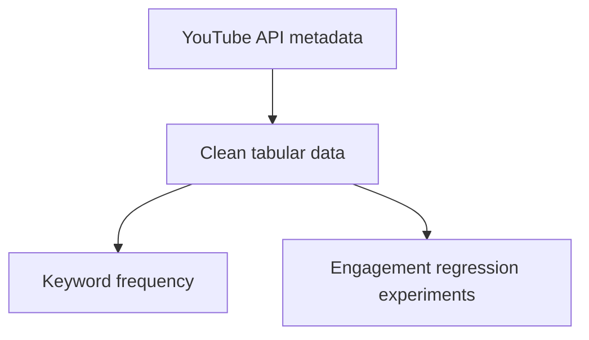

# YouTube Title & Engagement Explorer

**A Python and Django prototype for exploring YouTube metadata, keyword frequency, and engagement regression.**

This project brings together YouTube Data API collection, pandas data preparation, scikit-learn experiments, and a Django form interface. The repository name reflects its original goal; the current code explores engagement for supplied titles and does **not** generate new titles or descriptions.

> **Status: local metadata search workflow repaired and tested offline.** Live search requires your own YouTube API key. Historical ML experiments remain incomplete; no validated prediction accuracy, SEO improvement, or production deployment is claimed.

## What is here

| Component | Implementation | Current status |
| --- | --- | --- |
| Video discovery | Search queries and snippet/statistics retrieval via YouTube Data API | Requires your own API key and quota |
| Metadata preparation | CSV exports, duplicate removal, missing-value handling | Small collected snapshots; not a benchmark dataset |
| Keyword exploration | CountVectorizer over text | Frequency analysis, not measured keyword search demand |
| Engagement experiments | Linear regression, linear SVR, MLP regression | Experimental target: views + likes + comments |
| Web interface | Validated Django form and responsive results templates | Search form and results connected; API errors handled |

## Explore the source

- [Main analysis script](analysis/youtube_seo_tool.py): collection, cleaning, keywords, and model experiments
- [Alternative script](extra%20files/seo_tool.py): functions and asynchronous collection
- [Django view](analysis/views.py), [form](analysis/forms.py), and [routes](analysis/urls.py)
- [Templates](templates): input and result screens
- [Setup and known blockers](docs/DEVELOPMENT.md)
- [Credential handling](SECURITY.md)

## Historical analysis workflow

The web app separately retrieves snippets and renders result cards; it does not run this analysis pipeline.

The regression features are title length, competition, and search volume. The API collection does not supply the latter two measurements. They require a documented data source before model results can be interpreted responsibly.

## Local development

Use a separate virtual environment in VS Code. Install `requirements.txt`, set `DJANGO_SECRET_KEY`, and run `python manage.py runserver`. Set `YOUTUBE_API_KEY` to enable live search. Follow the [development guide](docs/DEVELOPMENT.md) for activation commands and offline tests. The web application does not import or execute the historical ML scripts.

## Evaluation and limitations

- No saved trained model or reproducible evaluation report is included.
- Likes and comments contribute to the engagement target; it is not a future-view forecast or a ranking guarantee.
- Placeholder search-volume values and unavailable competition data do not establish SEO performance.
- A random train/test split on a small trending-video sample does not demonstrate generalization across channels or time.
- The original collection code makes network calls and writes CSV files during import. Review it before execution.
- Existing CSV files are historical snapshots, not live trends. Collection time, reuse rights, and sampling coverage need documentation before redistribution as a dataset.

## Next engineering milestones

1. Refactor the historical ML experiments into explicit collection, feature preparation, training, and inference steps.
2. Extend metadata search with optional statistics and an offline demonstration dataset.
3. Define a consistent data schema and obtain real feature measurements.
4. Compare against a simple baseline using time-aware evaluation and publish measured results.
5. Add deployment configuration and end-to-end live API verification before hosting.

## Project context

Developed by **Manahil Iftikhar**. This repository is an exploratory project; the documentation distinguishes implemented code from future goals.

No license is currently declared. Third-party API data and dependencies remain subject to their respective terms.
